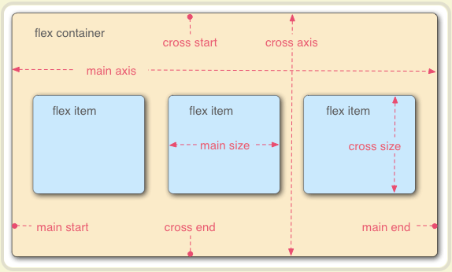
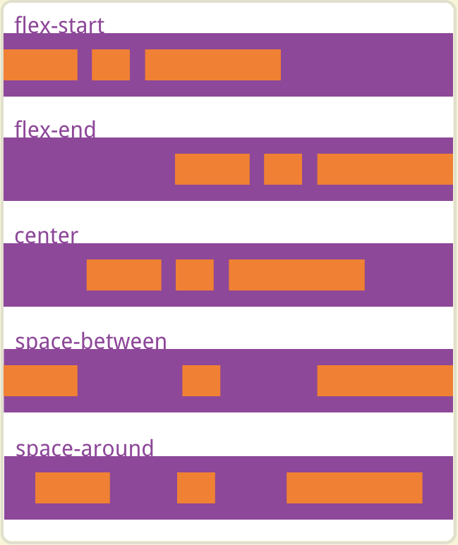
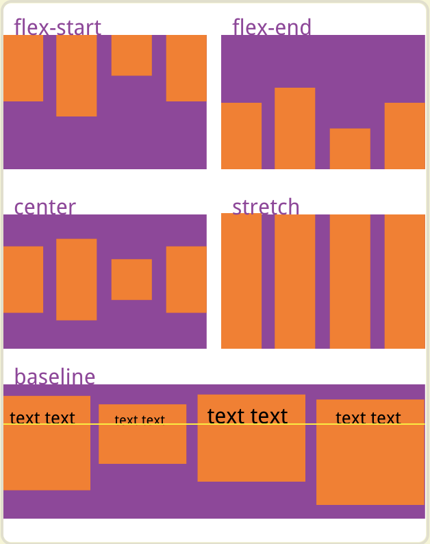
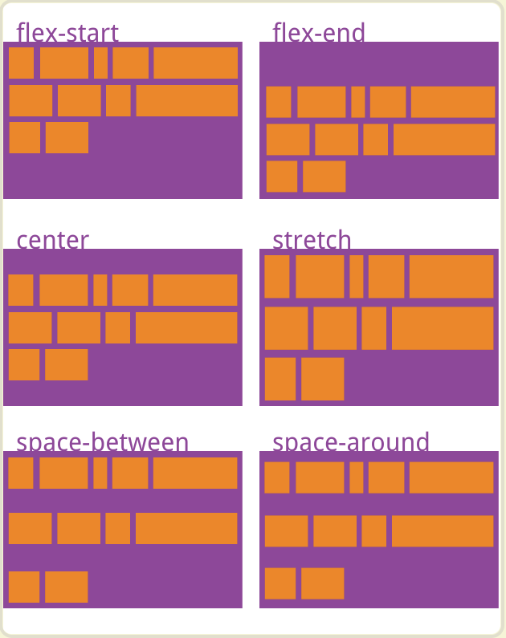
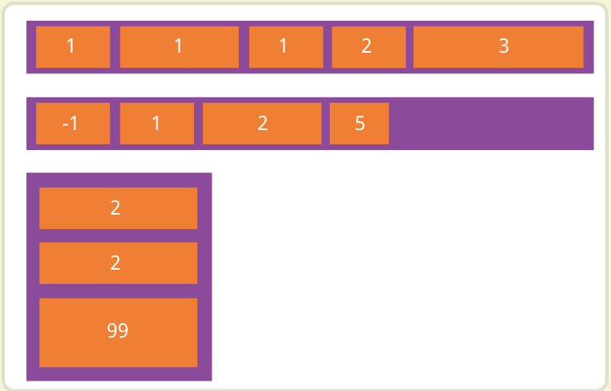
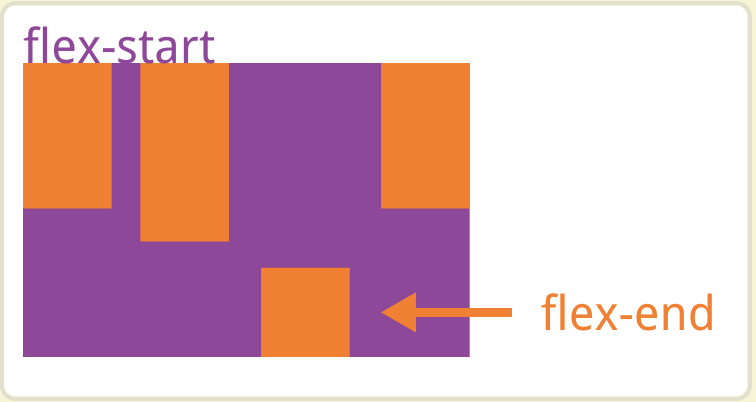

[toc]

# Flex 布局

网络布局是 CSS 的一个重点应用。

布局的传统解决方案，基于盒状模型，依赖 display 属性  + position 属性 + float 属性。它对于那些特殊的布局非常不友好。比如，垂直居中就不容易实现。

2009年，W3C提出了一中新的方案 —— flex布局，可以简便、完整、响应式的实现各种页面布局。目前，它已经得到了所有浏览器的支持。

Flex布局将是布局的首选方案。本文介绍它的语法，下一篇问号在哪个给出常见布局的 Flex 写法。

## 1. Flex 布局是什么？

Flex 是 Flexible  Box 的缩写，意为“弹性布局”，用来为盒状模型提供最大的灵活性。

任何一个容器都可以指定为flex布局。

```css
.box {
  display: flex;
}
```

行内元素也可以会用 Flex 布局。

```css
.box {
	display: inline-flex;
}
```

注意，设置为 Flex 布局以后，子元素的 float、clear、vertical-align 属性将失效。

## 2. 基本概念

采用 Flex 布局的元素，称为 Flex 容器（flex container）, 简称“容器”。它的所有子元素自动成为容器成员，称为 Flex 项目（flex item），简称“项目”。

容器默认存在两根轴： 水平的主轴（main axis）和垂直的交叉轴（cross axis）。主轴的开始位置（与边框的交叉点）叫做 main start，结束位置叫做 main end；交叉轴的开始位置叫做 cross start， 结束位置叫做 cross end。

项目默认沿主轴排列。单个项目占据的主轴空间叫做main size， 占据交叉轴空间胶州 cross size。



## 3. 容器的属性

以下6个属性设置在容器上。

- flex-directon
- flex-wrap
- flex-flow
- justify-content
- align-items
- align-content

### 3.1 flex-direction

属性决定主轴的方向（即项目的排列方向）

```css
.box {
	flex-direction: row | row-reverse | column | column-reverse
}
```

- row(默认值)： 主轴为水平方向，起点在左端。

- row-reverse： 主轴为水平方向，起点在右端。

- column： 主轴为垂直方向，起点在上沿。

- column-reverse： 主轴为垂直方向，起点在下沿。

  

### 3.2 flex-wrap

默认情况下，项目都排列在一条线上（轴线上）。flex-wrap 属性定义，如果一条轴排列不下，如何换行

```css
.box {
	flex-wrap: nowrap | wrap | wrap-reverse
}
```

- nowrap （默认）： 不换行


- wrap ： (换行) 第一行在上方。

   

- wrap-reverse: 换行，第一行在下方


### 3.3 flex-flow

是 flex-direction 和 flex-wrap 属性的简写形式，默认值为 row nowrap

```css
.box {
	flex-flow: <flex-direction> || <flex-wrap>
}
```

### 3.4 justify-content

定义了项目在主轴上的对齐方式

```css
.box {
	justify-content: flex-start | flex-end | center | space-between | space-around
}
```

- flex-start:  左对齐
- flex-end: 右对齐
- center：居中
- space-between：两端对齐，项目之前的间隔都相等
- space-around：每个项目两侧的间隔相等。所以，项目之间的间隔比项目与边框之间的间隔大一倍。




### 3.5 align-items 

定义项目在交叉轴上如何对齐

```css
.box {
	align-items: flex-start | flex-end | center | baseline | stretch
}
```

- flex-start： 交叉轴的起点对齐
- flex-end： 交叉轴的终点对齐
- center： 交叉轴的中点对齐
- baseline：项目的第一行文字的基线对齐
- stretch(默认值)：如果项目未设置高度或设为auto，将占满整个容器的高度



### 3.6 align-content 

定义了多根轴线的对齐方式。如果项目只有一根轴线，该属性不起作用。

```css
.box {
	align-content: flext-start | flex-end |center | space-between | space-around | stretch 
} 
```

- flex-start：与交叉轴的起点对齐。
- flex-end：与交叉轴的终点对齐。
- center：与交叉轴的中点对齐。
- space-between：与交叉轴两端对齐，轴线之间的间隔平均分布。
- space-around：每根轴线两侧的间隔都相等。所以，轴线之间的间隔比轴线与边框的间隔大一倍。
- stretch（默认值）：轴线占满整个交叉轴。



## 4. 项目的属性

以下六个属性设置在项目上

- order
- flex-grow
- flex-shrink
- flex-basis
- flex
- align-self

### 4.1 order 属性

定义项目的排列顺序。数值越小，排列越靠前，默认为0.

```css
.item {
	order: <integer>
}
```



### 4.2 flex-grow 

定义项目的放大比例，默认为 0，即如果存在剩余空间，也不放大。

```css
.item {
	flex-grow: <number>; /*default 0*/
}
```


如果所有项目的 flex-grow 属性都为1，则它们将等分剩余空间（如果有的话）。如果一个项目的 flex-grow 属性为2， 其他为1，则前者占据剩余的空间将比其他项多一倍。

### 4.3 flex-shrink

定义项目的缩小比例，默认为 1，即如果空间不足，该项目将缩小。

```css
.item {
	flex-shrink: <number>; /* default 1*/
}
```


如果所有项目的 flex-shrink 属性都为1，当空间不足时，都将等比例缩小。如果一个项目的 flex-shrink 属性为 0，其它项目都为 1，则空间不足时，前者不缩小。

负值无效

### 4.4 flex-basis 

定义在分配多余空间之前，项目占据的主轴空间（main size）， 浏览器根据这个属性，计算主轴是否有多余的空间。它的默认值是 auto， 即项目的本来大小。

```css
.item {
	flex-basis: <length> | auto; /* default auto*/
}
```

它可以设为跟 width 和 height 属性一样的值（比如350px），则项目将占据固定空间。

### 4.5 flex 

flex 属性是 flex-grow, flex-shrink 和 flex-basis 的简写，默认值为 0 1 auto。后面两个属性可选。

```css
.item {
	 flex: none | [<'flex-grow'> <'flex-shrink'>? || <'flex-basis'>]
}
```

该属性有两个快捷值：auto(1 1 auto) 和 none (0 0 auto)

### 4.6 align-self 

属性允许单个项目有与其他项目不一样的对齐方式，可覆盖 align-items 属性。默认值为 auto，表示继承父元素的 align-items 属性。如果没有父元素，则等同于 stretch。

```css
.item {
	algin-self: auto | flex-start | flex-end | center | baseline | stretch
}
```

