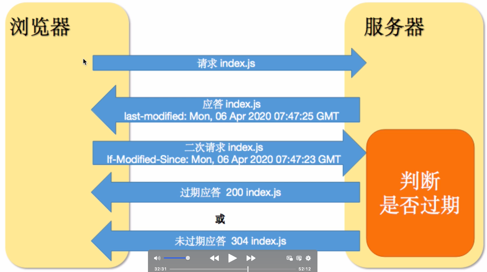

# HTTP 缓存机制 - NodeJS一步一步试验
## Web 缓存是什么
### 动机
当浏览器加载一个页面时html引用的外部资源也会加载。但是这些外部资源比如图片、CSS、JS都不经常变化。如果每次都加载这资源势必会带来资源的浪费。而且加载时间过长也会影响用户体验。

HTTP缓存技术就是为了解决这个问题出现的。简单的讲HTTP缓存就是将静态资源存储在浏览器内部，下次请求相同资源时可以直接使用。

当然何时使用何时不使用要有一系列的策略保证如果资源一旦更新，缓存也要随着更新。
### 强缓存策略
直接从本地副本比对读取，不去请求服务器，返回的状态码为200

这里面就有一个问题如果不去服务请求如果静态资源更新了而浏览器还在使用旧的静态资源怎么办？答案是使用定时器的方式也就是强缓存可以设置静态资源的有效期。如果超过有效期就认为缓存作废。
#### HTTP 1.0
1. expires
expires 是 HTTP1.0中定义的缓存字段。当我们请求一个资源，服务器返回时，可以咋Response Headers中增加expires字段表示资源的过时间
```http
expires: Thu, 03 Jan 2020 11:43:04 GMT
```
它是一个时间戳（格林尼治时间），当客户端再次请求资源的时候，会把客户端时间与改时间戳进行对比，如果大于改时间戳则已过期，否则直接使用该缓存资源。但是有个大问题，发送请求时是使用的客户端时间去对比。一是客户端和服务端时间可能快慢不一致，另一方面是客户端的时间是可以自行修改的（比如浏览器是跟随系统时间的，修改系统之时间会影响到），所以不一定满足预期

#### HTTP 1.1
cache-control
正由于上面说的可能存在的问题，HTTP1.1新增了 cache-control 字段来解决该问题，所以当 cache-control 和 expires 都存在时，cache-control 优先级更高。该字段是一个时间长度，单位秒，表示该资源过滤多少秒后失效。当客户端请求资源的时候，发现该资源还在有效时间内，则使用该缓存，它不依赖客户端时间。cache-control主要有max-age和smaxage、public和private、no-cache和no-store等值
| cache-directive | 说明 |
|------|------|
| public | 所有内容都将被缓存（客户端和代理服务器都可缓存） |
| private | 内容只缓存到私有缓存中（客户端可以缓存） |
| no-cache | 需要使用协商缓存来验证缓存数据 |
| no-store | 所有内容都不会缓存 |
| must-revalidation/proxy-revalidation | 如果缓存的内容失效，请求必须发送到服务器/代理以进行重新验证 |
| max-age=xxx(xxx is numeric) | 缓存的内容将在XXX秒后失效，这个选项只在HTTP1.1可用，并如果和Last-Modified一起使用时，优先级较高 |

### 协商缓存策略
上面的expires 和 cache-control 都会访问本地缓存直接验证看是否过期，如果没过期直接使用本地缓存，并返回200.但如果设置了no-cache 和 no-store 则本地缓存会被忽略，回去请求服务器验证资源是否更新，如果没更新继续使用本地缓存，此时返回304，这就是协商缓存。协商缓存主要包括 last-modified 和 etag

协商缓存简单的说就是浏览器和服务器间就是否要使用缓存做协商。如果协商的结果是需要更新就会返回200并返回更新内容。如果不需要更新只需要返回状态码304，这样虽然需要后端应答但是后端既不需要生成内容也不需要传输内容。依然可以享受缓存的种种好处

#### last-Modified & if-Modified-Since
这是一组通过协商修改时间为基础的策略

#### etag & if-None-Match
另一种是通过内容判断，一般的做法是将返回内容进行摘要（hash），然后通过对比摘要来判断内容是否更新

