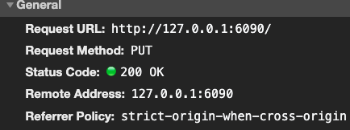

[toc]

# 跨域及解决方案

## 1. 什么是跨域

跨域到底是谁限制了？浏览器限制了，跨的域也是浏览器

回顾一下 URI 的组成：


浏览器遵循同源策略（scheme(协议)、host(主机)和port(端口)都相同则为同源）。非同源站点有这样一些限制：

- 不能读取和修改对象的DOM
- 不能读取和访问对方的 Cookie、IndexDB 和 LocalStorage
- 限制 XMLHttpRequest 请求

接下来我们来说一说解决跨域问题的解决方案。

## 2. Jsonp

HTML 标签中，一些标签如 script、img  这样的获取资源的标签是没有跨域限制的

jsonp 跨域其实也是 JS 设计模式中的一种代理模式。方式为 动态的创建 script 标签，然后再去请求一个带参网址来实现跨域通信。

```html
<body>
  <script>
    const script = document.createElement("script");
    script.setAttribute("src", "http://127.0.0.1:6090/?cb=callback");
    document.body.appendChild(script);
    function callback(data) {
      console.log(data);
    };
  </script>

</body>
```

```js
const http = require('node:http');
const url = require('node:url');

const app = http.createServer((req, res) => {
  if (req.url !== '/favicon.icon') {
    const { query } = url.parse(req.url, true);
    res.writeHead(200, { 'Content-Type': 'application/javascript' });
    const data = '这是一个后端数据，通过 jsonp 的方式传给了前端';
    res.end(`${query.cb}(${JSON.stringify(data)})`);
  }
});

const port = 6090;
app.listen(port, (err) => {
  if (err) {
    throw err;
  }
  console.log(`app start at ${port}`);
});
```

通过 jsonp 的方式后端就把数据传回给了前端。

但是存在巨大的缺陷

1. 前端需要知道后端的传回数据的 function 名，也就是 callback 需要知道，很明显如果后端程序不是自己的，肯定是行不通的
2. 就算后端程序是自己写的，那么，jsonp 由于其通过标签方式解决跨域的原理，只能发起 get请求

## 3. cors

cors 其实是 W3C 的一个标准，全称跨域资源共享。需要浏览器和服务器的共同支持，具体来说，服务器需要附加特定的响应头。在弄清楚 cors 的原理这钱，需要理解两个概念：简单请求和非简单请求。

浏览器根据请求方法和请求头的特定字段，将请求做了一下分类，具体来说规则是这样，凡是满足下面套件的属于简单请求：

- 请求方式为 HEAD、POST或者GET
- HTTP的头信息不超出以下几种字段：
  - Accept、Accept-Language、Conent-Language、Last-Event-ID
  - Content-Type：只限于三个值application/x-www-form-urlencoded、multipart/form-data、text/plain

### 3.1 简单请求

```js
// 客户端
<script>
  const xhr = new XMLHttpRequest();
  xhr.open('GET', 'http://127.0.0.1:6090');
  xhr.send();
</script>;

// 服务端
const app = http.createServer((req, res) => {
  console.log(req.method);
  res.writeHead(200, {
    'Access-Control-Allow-Origin': '*'
  });
  res.end('test for cors');
});
```

cors 默认不发送 cookies 和 HTTP 认证信息。如果要把 Cookie 发送到服务器，一方面要服务器同意，指定 `Access-Control-Allow-Credentials` 字段。否则，即使服务器同意发送 Cookie，浏览器也不会发送。或者，服务器要求设置 Cookie，浏览器也不会处理。 但是，如果省略 `withCredentials` 设置，有的浏览器还是会一起发送 Cookie。这时，可以显式关闭 `withCredentials`。

需要注意的是，如果要发送 Cookie，**Access-Control-Allow-Origin 就不能设为星号**，必须指定明确的、与请求网页一致的域名。同时，Cookie 依然遵循同源政策，只有用服务器域名设置的 Cookie 才会上传，其他域名的 Cookie 并不会上传，且（跨源）原网页代码中的 document.cookie 也无法读取服务器域名下的 Cookie。

```js
// 客户端
<script>
  const xhr = new XMLHttpRequest();
  xhr.withCredentials = true;
  xhr.open('GET', 'http://127.0.0.1:6090');
  xhr.send();
</script>;

// 服务端
const app = http.createServer((req, res) => {
  console.log(req.method);
  res.writeHead(200, {
    'Access-Control-Allow-Origin': 'http://127.0.0.1:5500',
    'Access-Control-Allow-Credentials': true // 允许携带 cookie
  });
  res.end('test for cors');
});
```

### 3.2 非简单请求

非简单请求是那种对服务器有特殊要求的请求，比如请求方法是 PUT 或 DELETE，或者 Content-Type 字段的类型是 application/json.

非简单请求的CORS 请求，会在正式通信之前，增加一次 HTTP 查询请求，称为"预检"请求（preflight, options）。

浏览器先询问服务器，当前网页所在的域名是否在服务器的许可名单之中，以及可以在使用哪些 HTTP 动词和头信息字段。只有得到肯定答复，浏览器才会发出正式的 XMLHttpRequest请求，否者就报错。

```js
// 客户端
<script>
  const xhr = new XMLHttpRequest();
  xhr.open('PUT', 'http://127.0.0.1:6090');
  xhr.setRequestHeader('Content-Type', 'application/x-www-form-urlencoded');
  xhr.send();
</script>;

// 服务端
const app = http.createServer((req, res) => {
  console.log(req.method);
  res.writeHead(200, {
    'Access-Control-Allow-Origin': 'http://127.0.0.1:5500',
    'Access-Control-Allow-Methods': 'POST, PUT, DELETE', // 支持
    'Access-Control-Max-Age': '1000' // 指定本次预检请求的有效期，单位为秒
  });
  res.end('test for cors');
});
```




### 4. nginx

利用服务器进行代理

```bash
server {
  #...

  location /api {
    proxy_pass http://127.0.0.1:6060;
  }
}
```

### 5. iframe + postMessage
