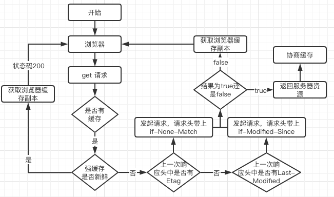
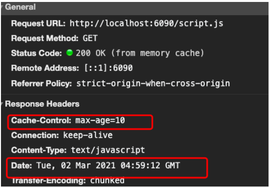

[toc]

# HTTP缓存机制

## 1. 前言

HTTP Cache 使我们开发中接触最多的缓存，一般把它分为强缓存和协商缓存。

- 强缓存： 当副本足够新鲜时，直接从本地副本获取，不去请求服务器，返回状态码 200
  - Expires: time
  - Cache-Control: max-age
- 协商缓存： 按照首部与服务器进行比对，若结果为false则直接使用副本，状态码 304，为true则返回服务器对应的资源
  - If-None-Match    Etag   
  - If-Modified-Since  Last-Modified

缓存优先级

Pragma > Cache-Control > Expires > Etag > Last-Modified




## 2. 强缓存

### 2.1 Expires

当请求一个资源，服务器返回是，可以在 `Response Headers` 中增加 `expires` 字段表示资源的过期时间。是一个绝对时间。

```js
const http = require('http');
const fs = require('fs');

const app = http.createServer((req, res) => {
  const { url } = req;
  if (url === '/') {
    const file = fs.readFileSync("./index.html");
    res.setHeader("Content-Type", "text/html");
    res.end(file);
  } else if (url === '/script.js') {
    const file = fs.readFileSync("./script.js");
    const now = new Date();
    now.setSeconds(now.getSeconds() + 60); // 获取当前时间的 60 秒后

    res.writeHead(200, {
      'Content-Type': 'text/javascript',
      Expires: now.toGMTString()
    });
    res.end(file);
  }
});

const port = 6090;
app.listen(port, err => {
  if (err) throw err;
  console.log(`app start at ${port}`);
});
```


但是，Expires 采用的是绝对过期时间，使用 Expires 时需要服务器和客户端完全保持一致，才能保证缓存起到正确的作用，显然这是很难的。因此，HTTP 1.1 新增了 `Cache-Control`字段来解决这个问题。

### 2.2 Cache-Control

由于 Expires 出现的问题，  HTTP 1.1 新增了 `Cache-Control`字段来解决这个问题，所以当 Cache-Control 和 Expires 都存在时， Cache-Control 优先级更高。

```js
"Cache-Control": 'max-age=2000'
```

Cache-Control 的值

- public： 表明响应可以被任何对象缓存（包括：发送请求的客户端，代理服务器，等等）
- private： 用户本地才可以缓存
- no-store：不允许缓存，用于某些变化非常频繁的数据，例如秒杀页面；浏览器和中间带来服务器都不能缓存资源。
- no-cache: 跳过当前的强缓存，发送HTTP 请求，直接进入协商缓存阶段。也就是资源可以存储在本地缓存区中的。只是在与原始服务器进行新鲜度在验证之前，缓存不能将其提供给客户端使用。这个首部使用 do-not-serve-from-cache-without-revelidation 这个名字将会更加恰当。
- must-revelidate： 如果缓存不过期就可以继续使用，但过期了还想用就必须去服务器验证。
- max-age=[seconds]: 单位秒
- s-maxage=[seconds]: 覆盖 max-age 或者 expires 头，但是仅仅适用于共享缓存（比如各个代理），私有缓存会忽略它。

```js
else if (url === '/script.js') {
  const file = fs.readFileSync("./script.js");

  res.writeHead(200, {
    'Content-Type': 'text/javascript',
    "Cache-Control": "max-age=10"
  });
  res.end(file);
}
```



## 3. 协商缓存

强缓存失效之后，浏览器在请求头中携带相应的缓存 tag 来向服务器发请求，由服务器根据这个 tag 来决定是否使用缓存，这就是协商缓存。

### 3.1 Last-Modified  If-Modified-Since

Last-Modified 记录资源最后修改的时间。启用后，请求资源之后的响应头会增加一个 `last-modified` 字段，当再次请求该资源时，请求头中会带有`if-modified-since`字段

- 如果自指定日期后，文档被修改了，If-Modified-Since 条件就为真，通常 Get 就会成功执行。携带新首部的新文档会被返回给缓存，新首部除了其他信息之外，还包括了一个新的过期日期。

- 如果资指定日期后，文档没有被修改过，条件为假，会向客户端返回一个小的 304 Not Modified 响应报文，为了提高有效性，不会返回文档的主体。这些首部是放在响应中返回的，但只会返回那些需要在源端更新的首部。比如，Content-Type 首部通常不会被修改，所以通常不需要发送。一般会发送一个新的过期日期。

  > 但 last-modified  有以下两个缺点：
  >
  > 1. 只要编辑了，不管内容是否真的有改变，都会以这最后修改的时间作为判断依据，当成新资源返回，从而导致没必要的请求响应。
  > 2. 时间的精确度只能到秒，如果在一秒内修改，那么是检测不到的

```js
let now = new Date();
setInterval(() => {
  now.setSeconds(now.getSeconds() + 1);
  console.log('lastModified:', now.toUTCString());
}, 5000);

const app = http.createServer((req, res) => {
  const { url } = req;
  if (url === '/') {
    const file = fs.readFileSync("./index.html");
    res.setHeader("Content-Type", "text/html");
    res.end(file);
  } else if (url === '/script.js') {
    const file = fs.readFileSync("./script.js");
    const isModifiedSince = req.headers["if-modified-since"];
    const lastModified = now.toUTCString();
    if(lastModified === isModifiedSince) {
      res.writeHead(304, { 'Last-Modified':  lastModified});
      res.end();
    }else {
      res.writeHead(200, {
        'Content-Type': 'text/javascript',
        'Cache-Control': "no-cache",
        'Last-Modified': lastModified
      });
      res.end(file);
    }  
  }
});
```


### 3.2 Etag / If-None-Match

Etag 是服务器根据当前文件协商内容，给文件生成的唯一标识，只要里面的内容有改动，这个值就会变。服务器通过响应头把这个值给浏览器。

浏览器接收到 Etag的值，会在下次请求时，将这个值作为 If-None-Match 这个字段的内容，并放到请求头中，然后发给服务器。

服务器接收到 If-None-Match 后，会跟服务器上该资源的 Etag 进行比较：

- 如果两者一样，说明为更新，返回304，浏览器使用缓存
- 否者说明更新了，返回新的资源


### 3.3 两者对比

1. 精度上， Etag 优于 Last-Modified。

   优于 ETag 是按照内容给资源上标识，因此能准确感知资源的变化。而 Last-Modified 就不一样了，它在一些特殊的情况并不能准确感知资源变化，主要有两种情况:

   - 编辑了资源文件，但是文件内容并没有更改，这样也会造成缓存失效。
   - Last-Modified 能够感知的单位时间是秒，如果文件在 1 秒内改变了多次，那么这时候的 Last-Modified 并没有体现出修改了。

2. 性能上，Last-Modified 优于 Etag

   也很简单理解，Last-Modified 仅仅只是记录一个时间点，而 Etag 需要根据文件的具体内容生成哈希值。


## 4. 缓存位置

前面提到，当强缓存命中或者协商缓存中服务器返回 304 的时候，我们直接从缓存中获取资源。那这些资源究竟存在什么位置呢?

浏览器中的缓存位置一共有四种，按照优先级从高到低排列分别是：

- Service Worker
- Memory Cache
- Disk Cache
- Push Cache

### 4.1 Service Worker

Service Worker 借鉴了 Web Worker 的 思路，即让 JS 运行在主线程之外，由于它脱离了浏览器的窗体，因此无法直接访问 DOM。虽然如此，但它仍然能帮助我们完成很多有用的功能，比如离线缓存、消息推送和网络代理等功能。其中的离线缓存就是 `Service Worker Cache`。

Service Worker 同时也是 PWA 的重要实现机制

### 4.2 Memory Cache 和 Disk Cache

Memory Cache 指的是内存缓存，从效率上讲它是最快的。但是从存活时间来讲又是最短的，当渲染进程结束后，内存缓存也就不存在了。

Disk Cache 就是存储在磁盘中的缓存，从存取效率上讲是比内存缓存慢的，但是他的优势在于存储容量和存储时长。稍微有些计算机基础的应该很好理解，就不展开了。

好，现在问题来了，既然两者各有优劣，那浏览器如何决定将资源放进内存还是硬盘呢？主要策略如下：

- 比较大的 JS、CSS 文件会直接被丢进磁盘，反之丢进内存
- 内存使用率比较高的时候，文件优先进入磁盘

### 4.3 Push Cache

即推送缓存，这是浏览器缓存的最后一道防线。它是 HTTP/2 中的内容，虽然现在应用的并不广泛，但随着 HTTP/2 的推广，它的应用越来越广泛。关于 Push Cache，有非常多的内容可以挖掘，不过这已经不是本文的重点，大家可以参考这篇[扩展文章](https://jakearchibald.com/2017/h2-push-tougher-than-i-thought/)。